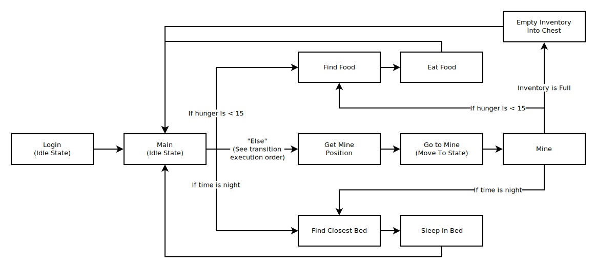
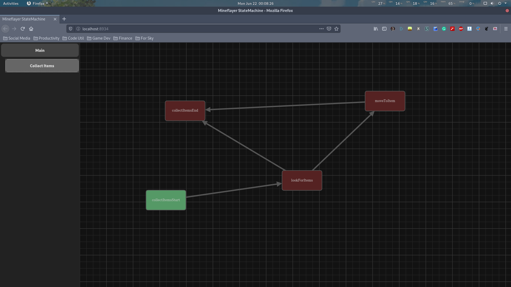
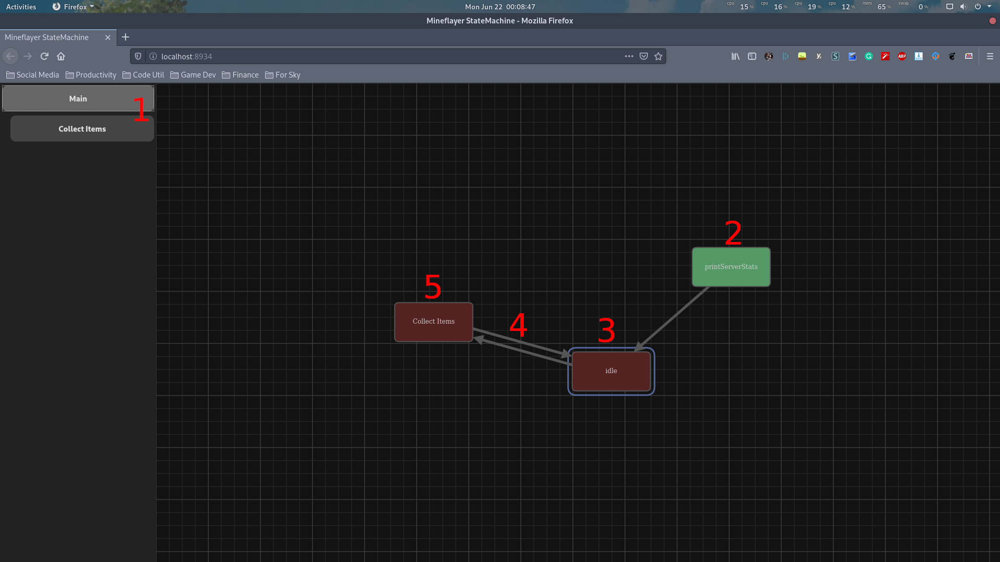

# API <!-- omit in toc -->

Welcome to the *mineflayer-statemachine* API documentation page.

## Table of Contents <!-- omit in toc -->

- [1. State Machine](#1-state-machine)
  - [1.1. StateBehaviors](#11-statebehaviors)
  - [1.2. Transitions](#12-transitions)
    - [1.2.1 Transition Execution Order](#121-transition-execution-order)
    - [1.2.2. Transition Based Events](#122-transition-based-events)
  - [1.3. Targets](#13-targets)
    - [1.3.1 Common Targets](#131-common-targets)
  - [1.4. Nested State Machines](#14-nested-state-machines)
- [2. Web View](#2-web-view)
  - [2.1. Activating the Web Vew](#21-activating-the-web-vew)
  - [2.2. Web View Components](#22-web-view-components)
    - [2.2.1 Layer Selection](#221-layer-selection)
    - [2.2.2 Enter/Exit State](#222-enterexit-state)
    - [2.2.3 Active State](#223-active-state)
    - [2.2.4 Transitions](#224-transitions)
    - [2.2.5 Nested States](#225-nested-states)
- [3. Existing Behaviors](#3-existing-behaviors)
  - [3.1. Follow Entity](#31-follow-entity)
  - [3.2. Get Closest Entity](#32-get-closest-entity)
      - [3.2.1 EntityFilters().AllEntities](#321-entityfiltersallentities)
      - [3.2.2 EntityFilters().PlayersOnly](#322-entityfiltersplayersonly)
      - [3.2.3 EntityFilters().MobsOnly](#323-entityfiltersmobsonly)
      - [3.2.4 EntityFilters().ItemDrops](#324-entityfiltersitemdrops)
  - [3.3. Idle](#33-idle)
  - [3.4. Look At Entity](#34-look-at-entity)
  - [3.5. Move To](#35-move-to)
  - [3.6. Print Server Stats](#36-print-server-stats)
  - [3.7. Equip Item](#37-equip-item)
  - [3.8. Find Block](#38-find-block)
  - [3.9. Find Interact Position](#39-find-interact-position)
  - [3.10. Interact Block](#310-interact-block)
  - [3.11. Mine Block](#311-mine-block)
  - [3.12. Place Block](#312-place-block)

## 1. State Machine

The state machine is the core of the *mineflayer-statemachine* plugin. Working with the state machine usually only has to be done in a single file where all required states and transitions are loaded.

The intended workflow when working with this plugin is to create many small, isolated behaviors that act on the bot independently. These are self contained states which can be configured and reused as needed. In the `index.js` file, the structure and shape of the state machine is created.

Due to most behaviors relying on the bot within the constructor, as well as relevant server information, it is recommended to initialize the state machine after the spawn has finished logging in.

### 1.1. StateBehaviors

A state behavior, often referred to simply as 'behavior', is a isolated module within the state machine. Within the state machine, only a single state is active at a time, per layer. While a state is active, it begins preforming a configurable action on the bot until another state becomes active. While most states operate continuously, it's also common to preform a single action when the state is first entered and remain idle until until the state is exited.

If you want to write your own behaviors, simply extend the StateBehavior class. The `onStateEntered()` and `onStateExited()` functions can be overridden to implement your own actions. The `stateName` field should also be present, containing a short, user-friendly name of the state. This is what's shown in the web view and in debug logging.

Lastly, the `active` field should be initialized and set to false. The field is assigned by the state machine to true when the state is active and false when the state is not active. This field should be treated as read only.

Putting it all together should look like this:

<sub>*(JavaScript)*</sub>
```js
// Build the state
const myState = (function(){
    function MyState(bot)
    {
        this.bot = bot;
        this.active = false;
        this.stateName = 'myStateName';
    }

    MyState.prototype.onStateEntered = function () {
        console.log(`${bot.username} has entered the ${this.myStateName} state.`);
    };
    MyState.prototype.onStateExited = function () {
        console.log(`${bot.username} has left the ${this.myStateName} state.`);
    };

    return MyState;
}());

// Creating a new instance
const myStateIndex = new MyState(bot /* your bot */);
```

<br />

<sub>*(TypeScript)*</sub>
```ts
// Build the state
export class MyState implements StateBehavior
{
    active: boolean = false;
    stateName: string = 'myStateName';

    constructor(bot: Bot)
    {
        this.bot = bot;
    }

    onStateEntered(): void
    {
        console.log(`${bot.username} has entered the ${this.myStateName} state.`);
    }

    onStateExited(): void
    {
        console.log(`${bot.username} has left the ${this.myStateName} state.`);
    };
}

// Creating a new instance
const myStateIndex = new MyState(bot /* your bot */);
```

### 1.2. Transitions

A transition is how the bot knows when to move from one state to another. They are extremely quick to set up.

```js
// Create your state instances normally
const idleState = new BehaviorIdle();
const printServerStats = new BehaviorPrintServerStats(bot /* your bot */);

// Create a transition between two states
const transition = new StateTransition({
    parent: idleState, // The state to move from
    child: printServerStats, // The state to move to
    name: 'myTransitionName', // Optional. Used for debugging
    shouldTransition: () => false, // Optional, called each tick to determine if this transition should occur.
    onTransition: () => console.log("Printing server stats:"), // Optional, called when this transition is run.
});
```

In the example above, we are creating a simple transition between the idle state and the print server stats state. This transition does not happen immediately; it just lets the state machine know this transition is allowed to occur.

There are two approaches which can be used to trigger a transition. We can trigger the transition directly by calling:

```js
transition.trigger();
```

This can be called when a certain event happens, such as the player saying something in chat, or the bot receiving damage. Calling the `trigger()` function on a state which is not active has no effect, so you don't need to worry about checking what state the bot is currently in. Trigger all relevant transitions and the state machine will handle the rest.

The second approach to triggering a transition is to override the `shouldTransition()` function on the transition object. This can be done in the constructor or assigned normally at any time. This function is called every frame the parent state is active to check if the transition should occur. If it returns true, the transition is triggered. Otherwise, the transition is not triggered.

You can use this to monitor a system continuously for a specific condition to be met. Once the condition is met, the transition will occur automatically. Such as:
```js
shouldTransition: () => getDistanceBetween(bot, player) < 5;

shouldTransition: () => bot.health <= 3;

shouldTransition: () => bot.entity.position.y > 8 && bot.entity.position.y < 16;

shouldTransition: () => true; // Run transition on next tick.

shouldTransition: () => P === NP; // Run transition on next tick.
```

#### 1.2.1 Transition Execution Order

Checks are made to transitions in the order in which they are provided to the state machine. Transitions at the front of the list are executed before transitions later in the list. If multiple transitions share the same parent state and all return true, the transition earlier in the list is given priority.

This can be used to make an "else" condition in certain circumstances.

```js
const transitions = [

    new StateTransition({ // Called if the bot has a steak
        parent: tryToEat,
        child: eatSteak,
        shouldTransition: () => bot.hasSteak(),
    }),

    new StateTransition({ // Called if the bot has a fish, but no steak
        parent: tryToEat,
        child: eatFish,
        shouldTransition: () => bot.hasFish(),
    }),

    new StateTransition({ // Called if the bot doesn't have a steak or a fish
        parent: tryToEat,
        child: findFood,
        shouldTransition: () => true,
    }),
];
```

#### 1.2.2. Transition Based Events

Using transitions, modularity can be achieved easily through keeping states reusable and isolated. See the chart below:



In this example, bot bot will attempt to mine unless it gets hungry or the time turns to night. The allows the bot to be reactive to different events which occur in the world around it. By continuously moving the AI back to the main state after completing a task, it can preform addition checks for the next task to preform, including what tasks can be interrupted or not. Through this manner, it becomes very easy to add more complex behaviors to your bot.

By keeping parent-level events, such as the find-food and find-closest-bed functions, a transition can be made to these states without worrying about how they are implemented. It can also be useful to add an empty idle state to the front of these event chains. This allows even further customization to be done to the chains without worrying about how these are implemented. They become easy to change and expand in the future. Let's say for example, we want to add a special handler for being eating. Such as if the bot is already holding food.


Now, we can transition to the eat state machine without caring how the eat function is implemented. We can even store the `canEat` variable in the **targets** object (see [Targets](#13-targets))

### 1.3. Targets

Targets are the main method in which information should be passed between states. The target object is a single object that is passed into the constructor of all required behaviors.

```js
const bot = /* your bot*/;
const targets = {};

const behavior1 = new MyBehavior1(bot, targets);
const behavior2 = new MyBehavior1(bot, targets);
const behavior3 = new MyBehavior1(bot, targets);
```

This allows information to be passed between states quickly and easily by assigning values to the targets object that all states should be aware about. This is used to ensure states remain modular and isolated as much as possible. A common example of this is following an entity. We want to follow the targeted entity, but don't care how or why we targeted it. You can use a standard `setEntity()` method on the state, but this just bloats our code, adds more header, and makes it harder to read and expand.

Instead, we can simply use the `targets.entity` field. If it's not assigned, no entity is targeted, so preform no action. If it is assigned, follow that entity. We can assign the target from another behavior entirely to control this.

Let's say we want to pick up all nearby items. Doing this is very simple with targets and requires no extra code. The `GetClosestEntity` behavior can be used and configured to target the nearest item, if any and assign it to the `targets.entity` field. A transition is made from the getClosestEntity state to the followEntity state, which will automatically move to the item and pick it up.

This makes our code reusable, too! For example, if we had a state which gets our last damage source, we can quickly and easily reuse the followEntity state for both collecting items or hunting down an attacker without any changes to either state's code.

**Note:** When working with targets, it should be assumed that any specific target may be unassigned. Check if the value exists before using it.

#### 1.3.1 Common Targets

In order to keep things as portable as possible, behaviors are encouraged to keep a uniform naming style for targets. If one behavior used the target `targets.entity` and another behavior used the target `targets.itemDrop`, then it would be difficult for behaviors to effectively interact with each other. Below is a table of common target names and the data type they represent.

| Variable Name     | Usage                                                                                                                                 |
| ----------------- | ------------------------------------------------------------------------------------------------------------------------------------- |
| targets.entity    | This target is used to represent any entity. It is up to the behavior to determine whether the entity is of the expected type or not. |
| targets.entities  | A list of entities. See `targets.entity`                                                                                              |
| targets.position  | A 3D position within the world. Can represent a block or floating point position.                                                     |
| targets.positions | A list of 3D positions. See `targets.position`                                                                                        |
| targets.item      | An inventory item.                                                                                                                    |
| targets.items     | A list of inventory items. See `targets.item`                                                                                         |
| targets.player    | A specific player. Should be used when working with player APIs specifically. Otherwise, `targets.entity` is recommend.               |
| targets.players   | A list of players. See `targets.player`                                                                                               |
| targets.blockFace | A vec3 representing a block face direction. Must be axis aligned with a length of 1.                                                  |

### 1.4. Nested State Machines

Nested state machines, often referred to as layers, are a method of making large state machines more manageable and more scalable. They work by allowing a state machine to act as a singular behavior within another state machine. This state can be transitioned into and out of like any other state. While this state is active, it's own inner state machine starts operating and updating as a normal state machine.

Nested state machines operate completely independently from their parent state machine. Neither needs to know how the other is implemented. This allows the state machine creation process to be separated across many files or classes easily.

A nested state machine can be created by passing in a list of transitions, an enter state, and an optional exit state.

```js
function createFollowPlayerState()
{
    const targets = {};
    const playerFilter = EntityFilters().PlayersOnly;

    const enter = new IdleBehavior();
    const exit = new IdleBehavior();

    const followPlayer = new BehaviorFollowEntity(bot, targets);
    const getClosestPlayer = new BehaviorGetClosestEntity(bot, targets, playerFilter);

    const transitions = [

        new StateTransition({
            parent: enter,
            child: getClosestPlayer,
            shouldTransition: () => true,
        }),

        new StateTransition({
            parent: getClosestPlayer,
            child: followPlayer,
            shouldTransition: () => targets.entity !== undefined,
        }),

        new StateTransition({
            parent: getClosestPlayer,
            child: exit,
            shouldTransition: () => targets.entity === undefined,
        }),

        new StateTransition({
            parent: followPlayer,
            child: exit,
            shouldTransition: () => followPlayer.distanceToTarget() < 2,
        }),

    ];

    return new NestedStateMachine(transitions, enter, exit);
}
```

After creating a nested state machine, it can be used like any other state!

```js
const idleState = new IdleBehavior();
const followPlayerState = createFollowPlayerState();

const transitions = [

    new StateTransition({
        parent: idleState,
        child: followPlayerState,
        shouldTransition: () => true,
    }),

    new StateTransition({
        parent: followPlayerState,
        child: idleState,
        shouldTransition: () => followPlayerState.isFinished(),
    }),

];
```

With this set up, the entire implementation of the followPlayer state is completely encapsulated, making it easy to tweak and adjust without needing to worry about breaking other states which rely on it.

## 2. Web View

As the size of a state machine grows, it can be hard to debug what exactly is going on or why certain events are occurring. It can often be useful to visualize the statemachine as it is running to get a better feel for how each of the gears and pulleys are working. The web view is a simple way to debug your state machine to ensure that everything is moving swiftly and easily.



Once enabled, the web view can be accessed through your browser by navigating to http://localhost:8934 on the same device as the bot. The port can optionally be adjusted or viewed on separate devices if allowed by your firewall settings.

It is worth noting that the web view is designed for informational purposes only and cannot currently control or direct the bot in any way.

### 2.1. Activating the Web Vew

To activate the web, you simply need to run create a new `StateMachineWebServer` object and pass in the state machine you want to expose.

```js
const stateMachine = new BotStateMachine(bot, rootLayer);
const webserver = new StateMachineWebserver(bot, stateMachine);
webserver.startServer();
```

You can optionally specify which port the web view should run on by passing it as a third argument.

```js
const port = 12345;
const webserver = new StateMachineWebserver(bot, stateMachine, port);
```

### 2.2. Web View Components



#### 2.2.1 Layer Selection

The right side panel can be used to specify which layer within the state machine is currently visible. These layers can be selected to switch which layer is currently being viewed.

Nested State Machines which reside within another layer are shown as indented below that layer in tree-style format. The name of the layer is the `stateName` of the nested layer object.

#### 2.2.2 Enter/Exit State

The enter state is the state which is activated when the layer is entered. It is shown in the web view, highlighted in green.

If a nested state machine layer has an exit state specified, it is shown in a yellow color. When this state is active, it singles to the parent state that it is ready to leave this layer.

#### 2.2.3 Active State

The active state within the layer is shown by a blue outline. This is the state or nested state machine which is currently running on the bot. As the bot switches behaviors, this outline will update automatically.

#### 2.2.4 Transitions

Transitions are shown as arrows pointing from the parent state to the child state. If moused over, the name of the transition will be shown if specified.

#### 2.2.5 Nested States

Nested state machines are represented in the web view as an ordinary state. If will show the blue outline when active and show transitions just like any other state. See [2.2.1 Layer Selection](#221-layer-selection) above for viewing the internal components of this nested state machine.

## 3. Existing Behaviors

There are several existing behaviors included with *mineflayer-statemachine* to help get most bots up and running with minimal setup required. You can find a complete list of this behaviors and their usage below.

There are two types of behaviors. Active and Passive behaviors. Active behaviors preform an action continuously until the state is exited, while passive behaviors are executed once when the state is entered and preform no further actions. When working with passive behaviors, it is recommended to transition out of the state instantly using something like `shouldTransition: () => true;` to avoid being idle for too long.

Passive states are intended for quick information-gathering or information-printing to configure the next state accordingly.

### 3.1. Follow Entity

Class Name: **BehaviorFollowEntity**
Type: **Active**

This behavior will path find to the target entity, ([Target `targets.entity`](#13-targets)), or try and get as close as possible. This behavior is built of using [mineflayer-pathfinder](https://github.com/Karang/mineflayer-pathfinder). The `movements` field of this behavior can be used to configure the pathfinding operation, as specified by the *mineflayer-pathfinder* API.

If the target entity is not assigned, this behavior will preform no action. If the target entity changes while this behavior is running, the `restart()` function on this behavior can be used to update the path finding accordingly.

### 3.2. Get Closest Entity

Class Name: **BehaviorGetClosestEntity**
Type: **Passive**

This behavior looks for the closest entity matching the entity filter when the state is entered and assigns it as the target entity ([Target `targets.entity`](#13-targets)). If no entity could be found, the target entity is assigned to undefined.

This behavior relies on providing an entity filter for deciding what type of entities to look for. The entity filter is simple a function, provided through the constructor, that is run on each entity. If the function returns true, the entity is considered in the distance calculation. If the function returns false, the entity is ignored.

Example which only checks entities that was within 5 blocks of the bot.
```js
function distanceFilter(entity)
{
    return bot.entity.position.distanceTo(entity.position) <= 5;
}

const getClosestEntity = new BehaviorGetClosestEntity(bot, targets, distanceFilter);
```

In addition to writing your own filters, there is a set of common filters specified in the global `EntityFilters()` function. You can find the complete list, below.

These can be used as:
```js
const getClosestEntity = new BehaviorGetClosestEntity(bot, targets, EntityFilters().PlayersOnly);
```

You can even use these filters in combination with your own to make more customized filters quickly.

```js
function distanceFilter(entity)
{
    return bot.entity.position.distanceTo(entity.position) <= 5
        && (EntityFilters().MobsOnly || EntityFilters().PlayersOnly);
}

const getClosestEntity = new BehaviorGetClosestEntity(bot, targets, distanceFilter);
```

##### 3.2.1 EntityFilters().AllEntities

Returns true for all entities.

##### 3.2.2 EntityFilters().PlayersOnly

Returns true for players.

##### 3.2.3 EntityFilters().MobsOnly

Returns true for mobs.

##### 3.2.4 EntityFilters().ItemDrops

Returns true for all item drops and collectable arrows.

### 3.3. Idle

Class Name: **BehaviorIdle** <br />
Type: **Active**

This behavior preforms no action. It's useful as a default state that the bot can use while waiting for a command.

### 3.4. Look At Entity

Class Name: **BehaviorLookAtEntity** <br />
Type: **Active**

This behavior will look at the target entity ([Target `targets.entity`](#13-targets)) without moving. If the target entity moves around, the bot will track it's movements. If no target entity is assigned, this behavior will do nothing.

By default, this behavior looks at the head of the target entity.

### 3.5. Move To

Class Name: **BehaviorMoveTo** <br />
Type: **Active**

This behavior will path find to the target position, ([Target `targets.position`](#13-targets)), or try and get as close as possible. This behavior is built of using [mineflayer-pathfinder](https://github.com/Karang/mineflayer-pathfinder). The `movements` field of this behavior can be used to configure the pathfinding operation, as specified by the *mineflayer-pathfinder* API.

If the target position is not assigned, this behavior will preform no action. If the target position changes while this behavior is running, the `restart()` function on this behavior can be used to update the path finding accordingly.

### 3.6. Print Server Stats

Class Name: **BehaviorPrintServerStats** <br />
Type: **Passive**

This behavior prints a set of debug information to the console about the server, such as Minecraft version, players online, game mode, etc. This can be used as an the initial state when first logging in to a server for debugging purposes.

### 3.7. Equip Item

Class Name: **BehaviorEquipItem** <br />
Type: **Passive**

This behavior causes the bot to equip the item as specified by ([Target `targets.item`](#13-targets)) This item can optionally be moved to the bots hand or equipped as armor.

If the target item is undefined or cannot be equipped for any reason, this behavior preforms no action.

### 3.8. Find Block

Class Name: **BehaviorFindBlock** <br />
Type: **Passive**

This behavior can be used to find a nearby block, of a given type, around the bot and store it's location as specified by ([Target `targets.position`](#13-targets)).

### 3.9. Find Interact Position

Class Name: **BehaviorFindInteractPosition** <br />
Type: **Passive**

This behavior is a quick information gathering-type behavior which is used to determine the best position to stand when interacting with blocks. This is useful for determining where to stand when breaking or placing blocks, opening chests, etc.

### 3.10. Interact Block

Class Name: **BehaviorInteractBlock** <br />
Type: **Passive**

This behavior triggers an active block action on the target block as specified by ([Target `targets.position`](#13-targets)). This will preform actions such as opening doors or pressing buttons.

### 3.11. Mine Block

Class Name: **BehaviorMineBlock** <br />
Type: **Active**

This behavior will cause the bot to attempt to mine the target block as specified by ([Target `targets.position`](#13-targets)). If a specific item is required to mine the given block, the bot will try to equip that item before mining the block.

### 3.12. Place Block

Class Name: **BehaviorPlaceBlock** <br />
Type: **Passive**

This behavior will place a given block specified by ([Target `targets.item`](#13-targets)), against the block specified location ([Target `targets.position`](#13-targets)), with the given block face to place against ([Target `targets.blockFace`](#13-targets)).